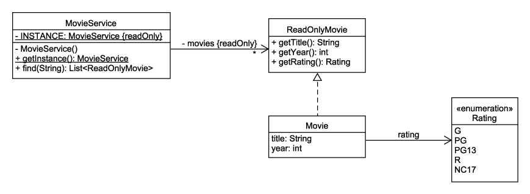

# Singleton Design Pattern

The Singleton design pattern is a creational design pattern that restricts a class to a single instance throughout an application. The Singleton pattern is useful when exactly one object is needed to coordinate actions across a system. For example, the Singleton design pattern is useful for holding runtime configuration information, logging, caching, resource pooling, or for providing services.

Here is an example of a Singleton that adds a movie service (sort of like a miniature version of IMDb) to our movie classes:



Note the following characteristics of the Singleton design pattern:

* The instance is stored as a private static variable.
* The Singleton provides a public static `getInstance()` method that returns a reference to the instance.
* The constructor is private. This hides the constructor to prevent other classes from instantiating the class.

The `MovieService` Singleton is implemented like this:

```java
public class MovieService {
    private static final MovieService INSTANCE = new MovieService();

    public static MovieService getInstance() {
        return INSTANCE;
    }

    private final List<ReadOnlyMovie> movies = new LinkedList<>();

    private MovieService() {
        Movie movie;

        movie = new Movie();
        movie.setTitle("Back to the Future");
        movie.setYear(1985);
        movie.setRating(Rating.PG);
        movies.add(movie);

        movie = new Movie();
        movie.setTitle("The Last Starfighter");
        movie.setYear(1984);
        movie.setRating(Rating.PG);
        movies.add(movie);

        // TODO add more movies
    }

    public List<ReadOnlyMovie> find(String text) {
        final List<ReadOnlyMovie> result = new LinkedList<>();
        final String search;

        if (text == null) {
            search = "";
        }
        else {
            search = text.toLowerCase();
        }

        for (final ReadOnlyMovie movie : movies) {
            if (movie.getTitle().toLowerCase().contains(search)) {
                result.add(movie);
            }
        }

        return result;
    }
}
```

You use it like this:

```java
// Find movies that have "the" in the title
List<ReadOnlyMovie> movies = MovieService.getInstance().find("the");
```
